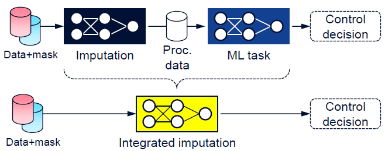

# Robust Deep Learning against Corrupted Data in Cognitive Autonomous Networks

Code and data accompanying the paper [Robust Deep Learning against Corrupted Data in Cognitive Autonomous Networks](https://ieeexplore.ieee.org/document/9789774)



## Dependencies
We have used the following software versions:
- cuda (11.3.1)
- python (3.8)
  - numpy (1.22)
  - scikit-learn (1.0.2)
  - pandas (1.3.5)
  - pytorch (1.10.1)

The scripts assume a linux-based system (Ubuntu), and have a hard-coded dependency on GPU acceleration (CUDA). If you wish to run the evaluation on the CPU, you should remove the `.to(device)` calls in the launching scripts found in `evals/`, under the `# Move to GPU ====` section.

## Launching scripts
The complete evaluation can be launched through the `evals_run.py` script. The script does not iterate on the missingness type (random or sequential), this has to be manually configured by supplying an argument:
```
evals_run.py --missing_type ran
```
For the complete evaluation, the `evals_run.py` script has to be run twice, with "ran" and "seq" missing types.

Individual algorithms can be launched by navigating to their respective directories in `evals/*`, and invoking the `*_fixm.py` or `*_varm.py` script. The arguments that can be supplied on the command line are visible under the `# Settings ====` section.

Other common parameters can be found in `common/defaults.py`.

The evaluation results can be printed with the `evals_agg.py` script, which also takes the `--missing_type` argument.
